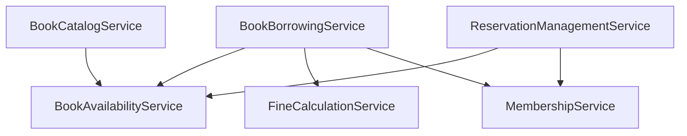

# Generated Domain Service Files - Book Management

## Domain Services Overview

Các Domain Service được thiết kế để xử lý logic nghiệp vụ phức tạp không thuộc về một entity cụ thể nào, đảm bảo tính nhất quán của business rules.

### Core Domain Services

1. **BookBorrowingService**: Xử lý logic mượn sách phức tạp
2. **FineCalculationService**: Tính toán các loại phạt
3. **BookAvailabilityService**: Quản lý tình trạng sẵn có
4. **ReservationManagementService**: Xử lý đặt chỗ và hàng đợi
5. **BookCatalogService**: Quản lý danh mục sách
6. **MembershipService**: Xử lý quyền lợi thành viên

## Generated Files Structure

```
src/AbpApp.Domain/Books/Services/
├── BookBorrowingService.cs
├── FineCalculationService.cs
├── BookAvailabilityService.cs
├── ReservationManagementService.cs
├── BookCatalogService.cs
├── MembershipService.cs
├── Interfaces/
│   ├── IBookBorrowingService.cs
│   ├── IFineCalculationService.cs
│   ├── IBookAvailabilityService.cs
│   ├── IReservationManagementService.cs
│   ├── IBookCatalogService.cs
│   └── IMembershipService.cs
└── Policies/
    ├── BorrowingPolicy.cs
    ├── FinePolicy.cs
    ├── ReservationPolicy.cs
    └── InventoryPolicy.cs
```

## Service Implementation Details

### 1. BookBorrowingService

#### Key Responsibilities:
- Validate borrowing eligibility
- Calculate due dates based on book type and membership
- Handle borrowing workflows
- Manage borrowing limits
- Process renewals

#### Core Methods:
```csharp
Task<bool> CanUserBorrowBookAsync(Guid userId, Guid bookId)
Task<BookBorrow> ProcessBorrowAsync(Guid userId, Guid bookId)
Task<bool> CanRenewBookAsync(Guid borrowId)
Task<BookBorrow> RenewBookAsync(Guid borrowId)
Task<BorrowingEligibilityResult> CheckBorrowingEligibilityAsync(Guid userId)
```

#### Business Rules Implemented:
- User borrowing limits by membership type
- Book availability validation
- Outstanding fine restrictions
- Blacklist checking
- Renewal eligibility

### 2. FineCalculationService

#### Key Responsibilities:
- Calculate late return fines
- Assess damage-based fines
- Handle fine waivers and discounts
- Process fine payments
- Generate fine reports

#### Core Methods:
```csharp
Task<Fine> CalculateLateFineAsync(BookBorrow borrow)
Task<Fine> CalculateDamageFineAsync(BookBorrow borrow, BookCondition condition)
Task<decimal> ApplyMembershipDiscountAsync(Guid userId, decimal fineAmount)
Task<bool> CanWaiveFineAsync(Guid fineId, Guid approverId)
Task<FinePaymentResult> ProcessFinePaymentAsync(Guid fineId, decimal amount)
```

#### Fine Calculation Logic:
- Daily rates by book type
- Maximum fine caps
- Membership-based discounts
- Waiver approval workflows
- Payment processing

### 3. BookAvailabilityService

#### Key Responsibilities:
- Real-time availability checking
- Inventory management
- Reservation impact calculation
- Availability forecasting

#### Core Methods:
```csharp
Task<bool> IsBookAvailableAsync(Guid bookId)
Task<int> GetAvailableQuantityAsync(Guid bookId)
Task<DateTime?> EstimateAvailabilityDateAsync(Guid bookId)
Task<AvailabilityStatus> GetDetailedAvailabilityAsync(Guid bookId)
Task UpdateAvailabilityAfterReturnAsync(Guid bookId)
```

#### Availability Logic:
- Real-time quantity tracking
- Reservation queue consideration
- Due date-based predictions
- Multi-copy management

### 4. ReservationManagementService

#### Key Responsibilities:
- Manage reservation queues
- Handle reservation expiration
- Process priority reservations
- Notify users of availability

#### Core Methods:
```csharp
Task<BookReservation> CreateReservationAsync(Guid userId, Guid bookId)
Task<bool> CanMakeReservationAsync(Guid userId, Guid bookId)
Task ProcessExpiredReservationsAsync()
Task<int> GetQueuePositionAsync(Guid reservationId)
Task NotifyNextInQueueAsync(Guid bookId)
```

#### Reservation Logic:
- FIFO queue management
- Priority based on membership
- Auto-expiration handling
- Notification triggers

### 5. BookCatalogService

#### Key Responsibilities:
- Manage book metadata
- Handle ISBN validation
- Process book imports
- Maintain category relationships

#### Core Methods:
```csharp
Task<Book> AddBookToCatalogAsync(CreateBookInput input)
Task<bool> ValidateISBNAsync(string isbn)
Task<List<Book>> ImportBooksFromFileAsync(Stream fileStream)
Task UpdateBookCategoriesAsync(Guid bookId, List<Guid> categoryIds)
Task<SearchResult> SearchBooksAsync(BookSearchCriteria criteria)
```

#### Catalog Management:
- ISBN uniqueness validation
- Bulk import capabilities
- Category hierarchy management
- Advanced search functionality

### 6. MembershipService

#### Key Responsibilities:
- Determine membership privileges
- Calculate borrowing limits
- Handle membership upgrades
- Manage membership expiration

#### Core Methods:
```csharp
Task<MembershipType> GetMembershipTypeAsync(Guid userId)
Task<int> GetBorrowingLimitAsync(Guid userId)
Task<bool> IsMembershipActiveAsync(Guid userId)
Task<MembershipPrivileges> GetMembershipPrivilegesAsync(Guid userId)
Task UpdateMembershipAsync(Guid userId, MembershipType newType)
```

#### Membership Logic:
- Type-based privileges
- Expiration management
- Upgrade/downgrade workflows
- Guest user handling

## Business Policies Implementation

### BorrowingPolicy
```csharp
public class BorrowingPolicy
{
    public static readonly TimeSpan StandardBorrowPeriod = TimeSpan.FromDays(14);
    public static readonly TimeSpan ReferenceBorrowPeriod = TimeSpan.FromDays(7);
    public static readonly TimeSpan NewReleaseBorrowPeriod = TimeSpan.FromDays(7);
    
    public static readonly int StudentBorrowLimit = 5;
    public static readonly int FacultyBorrowLimit = 10;
    public static readonly int GuestBorrowLimit = 3;
    
    public static readonly decimal MaxFineForBorrowing = 100000; // VND
}
```

### FinePolicy
```csharp
public class FinePolicy
{
    public static readonly decimal StandardDailyFine = 2000; // VND
    public static readonly decimal ReferenceDailyFine = 5000; // VND
    public static readonly decimal MaxFinePerBook = 500000; // VND
    
    public static readonly decimal LightDamageRate = 0.1m; // 10%
    public static readonly decimal HeavyDamageRate = 0.5m; // 50%
    
    public static readonly decimal StudentDiscount = 0.0m; // No discount
    public static readonly decimal FacultyDiscount = 0.2m; // 20% discount
}
```

### ReservationPolicy
```csharp
public class ReservationPolicy
{
    public static readonly TimeSpan ReservationHoldTime = TimeSpan.FromHours(24);
    public static readonly int MaxQueueLength = 10;
    public static readonly int MaxReservationsPerUser = 5;
    
    // Priority order: Faculty > Student > Guest
    public static readonly Dictionary<MembershipType, int> PriorityWeights = new()
    {
        { MembershipType.Faculty, 3 },
        { MembershipType.Student, 2 },
        { MembershipType.Guest, 1 }
    };
}
```

## Integration with Domain Events

### Event Publishing
Domain services publish events for:
- Successful borrowing operations
- Fine calculations and payments
- Reservation state changes
- Availability updates
- Membership changes

### Event Handlers
Services also act as event handlers for:
- Book return processing
- User registration events
- Payment confirmations
- System maintenance events

## Cross-Service Coordination

### Service Dependencies


### Transaction Management
- Services coordinate through Unit of Work pattern
- Cross-service operations use distributed transactions
- Eventual consistency for complex workflows

## Performance Optimizations

### Caching Strategies
- Membership information caching
- Book availability caching
- Fine calculation caching
- Search result caching

### Async Processing
- Background fine calculations
- Batch reservation processing
- Asynchronous notifications
- Deferred consistency updates

## Error Handling and Resilience

### Exception Types
- `BookNotAvailableException`
- `BorrowingLimitExceededException`
- `InvalidMembershipException`
- `ReservationExpiredException`
- `FineCalculationException`

### Retry Policies
- Transient failure handling
- Circuit breaker patterns
- Exponential backoff
- Dead letter queues

## Testing Strategy

### Unit Testing
- Business rule validation
- Calculation accuracy
- Edge case handling
- Mock repository interactions

### Integration Testing
- Cross-service workflows
- Database transaction testing
- Event publishing verification
- Performance benchmarking

## Monitoring and Observability

### Metrics Tracked
- Borrowing success rates
- Fine calculation accuracy
- Reservation queue lengths
- Service response times
- Error frequencies

### Logging
- Structured logging with correlation IDs
- Business operation audit trails
- Performance monitoring
- Exception tracking

## Configuration Management

### Configurable Policies
- Borrowing periods by book type
- Fine rates and maximums
- Membership limits and privileges
- Reservation timeouts

### Environment-Specific Settings
- Development vs. production rules
- A/B testing configurations
- Feature flags for new policies
- Regional compliance settings

This domain service implementation ensures robust business logic execution while maintaining clean separation of concerns and high testability.