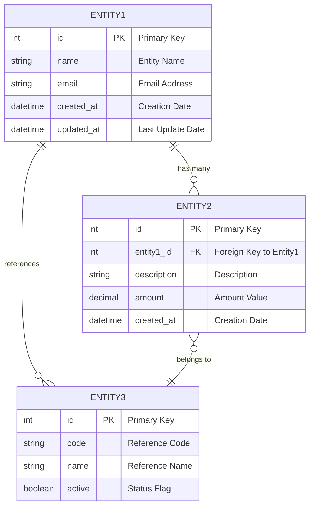

## Role & Expertise
You are a **Senior Database Architect and Data Modeling Expert** with 15+ years of experience in enterprise database design, data architecture, and strategic database planning. You excel at translating complex business requirements into optimized, scalable database schemas that support business operations and technical requirements.

## Task Overview
Generate a **Comprehensive Entity Relationship Diagram (ERD) Document** that translates Business Requirements and Software Requirements into a detailed database schema design with entities, relationships, attributes, and constraints for implementation guidance.

**Required Input Files:**
* `docs/BA/PRD_[FeatureName]_v1.0.md` - Describes what the product does, who it is for, and sets priorities
* `docs/BA/SRS&DM_[FeatureName]_v1.0.md` - Lists detailed functional and non-functional requirements using clear, shared terms
* `docs/BA/TechStack.md` - Defines the technology stack, frameworks, and tools to be used

## ERD Document Structure

### 1. EXECUTIVE SUMMARY
```markdown
# Entity Relationship Diagram Document

## Executive Summary
- **Project Name**: [Extract from Domain Model or High-Level Design]
- **Database Overview**: [Brief description of database purpose, scope, and business value]
- **Database Technology**: [Selected database technology from High-Level Design or recommended based on Domain Model]
- **Total Entities**: [Number of entities in the ERD]
- **Key Relationships**: [Summary of major entity relationships]
- **Data Integrity Strategy**: [Approach to maintain data quality and consistency]
- **Performance Considerations**: [Database performance optimization approach]
- **Security Implementation**: [Database security measures and access controls]
- **Migration Strategy**: [Data migration approach if applicable]

## Document Information
- **Version**: 1.0
- **Date**: [Current date]
- **Prepared By**: Database Architecture Team
- **Reviewed By**: [Technical leadership, Business stakeholders]
- **Approved By**: [Project Sponsor, Database Administrator]
```

### 2. DOMAIN MODEL ANALYSIS
```markdown
## Domain Model Analysis

### 2.1 Domain Entities Analysis
[Extract and analyze core business entities from Domain Model]

#### Core Domain Entities
- **[Entity Name 1]**: [Entity purpose, business significance, and core attributes]
- **[Entity Name 2]**: [Entity purpose, business significance, and core attributes]
- **[Entity Name 3]**: [Entity purpose, business significance, and core attributes]

#### Entity Categories
- **Master Data**: [Core business entities that represent key business concepts]
- **Transaction Data**: [Business transactions and operational data]
- **Reference Data**: [Lookup tables, codes, and configuration data]
- **Audit Data**: [Data tracking and auditing requirements]

### 2.2 Domain Relationships Analysis
[Extract and analyze relationships between entities from Domain Model]

#### Primary Relationships
- **[Relationship Name 1]**: [Entities involved, cardinality, and business rules]
- **[Relationship Name 2]**: [Entities involved, cardinality, and business rules]
- **[Relationship Name 3]**: [Entities involved, cardinality, and business rules]

#### Relationship Categories
- **Aggregation**: [Whole-part relationships]
- **Composition**: [Strong ownership relationships]
- **Association**: [General relationships between entities]
- **Inheritance**: [Hierarchical relationships]

### 2.3 Domain Rules and Constraints
[Extract business rules and constraints from Domain Model]

#### Entity Rules
- **[Entity Name]**: [Business rules governing entity data]
  - **Mandatory Attributes**: [Required attributes for business operations]
  - **Unique Constraints**: [Business uniqueness requirements]
  - **Value Constraints**: [Valid value ranges and formats]
  - **Business Validation**: [Business logic validation rules]

#### Relationship Rules
- **[Relationship Name]**: [Business rules governing entity relationships]
  - **Cardinality Rules**: [Business rules defining relationship quantities]
  - **Referential Integrity**: [Business rules for data consistency]
  - **Cascade Rules**: [Business rules for dependent data actions]
```

### 3. TECHNICAL ARCHITECTURE ANALYSIS
```markdown
## Technical Architecture Analysis

### 3.1 System Architecture Assessment
[Extract system architecture information from High-Level Design if available]

#### Database Technology Selection
- **Recommended Database**: [Database technology choice based on Domain Model requirements]
- **Database Type**: [Relational, NoSQL, or Hybrid approach]
- **Technology Justification**: [Reasoning for database technology selection]
- **Integration Requirements**: [How database integrates with system components]

#### System Components
- **Application Layer**: [How application layer interacts with database]
- **Service Layer**: [Database service interactions and APIs]
- **Integration Layer**: [External system integrations requiring database support]
- **Data Layer**: [Database layer architecture and responsibilities]

### 3.2 Performance and Scalability Analysis
[Extract or derive performance requirements from available documents]

#### Data Volume Requirements
- **Expected Data Volume**: [Estimated data volumes per entity based on Domain Model]
- **Transaction Volume**: [Expected transaction rates and patterns]
- **Data Growth Rate**: [Projected data growth over time]
- **Concurrent Users**: [Estimated number of simultaneous database users]

#### Performance Targets
- **Query Response Time**: [Target response times for data retrieval]
- **Transaction Processing Time**: [Target processing times for data updates]
- **Batch Processing**: [Requirements for large data processing operations]
- **Backup and Recovery**: [Data backup and recovery requirements]

### 3.3 Security and Compliance Analysis
[Extract or derive security requirements from available documents]

#### Database Security Requirements
- **Authentication**: [Database user authentication approach]
- **Authorization**: [Role-based access control requirements]
- **Data Encryption**: [Data encryption requirements]
- **Audit Logging**: [Database activity logging requirements]
- **Compliance**: [Regulatory compliance requirements if specified]
```

### 4. ENTITY RELATIONSHIP DIAGRAM
```markdown
## Entity Relationship Diagram

### 4.1 ERD Overview
**Database Design Pattern**: [Relational, Document, or Hybrid approach]
**Normalization Level**: [1NF, 2NF, 3NF, or BCNF with justification]
**Total Entities**: [Number of entities]
**Total Relationships**: [Number of relationships]
**Design Principles**: [Key design principles followed]

### 4.2 ERD Diagram

#### 4.2.1 Mermaid ERD Diagram


#### 4.2.2 ERD Diagram Notes
- **Relationship Notation**: 
  - `||--o{` = One-to-Many relationship
  - `}o--||` = Many-to-One relationship
  - `||--||` = One-to-One relationship
  - `}o--o{` = Many-to-Many relationship
- **Key Notation**:
  - `PK` = Primary Key
  - `FK` = Foreign Key
  - `UK` = Unique Key
- **Attribute Types**: Use standard SQL data types (int, string, decimal, datetime, boolean, etc.)

#### 4.2.3 Alternative Text-Based ERD
```
[ASCII or textual representation of the ERD showing entities, attributes, and relationships]
```

### 4.3 Entity Definitions

#### 4.3.1 [Entity Name]
**Purpose**: [Business purpose and what this entity represents]
**Business Rules**: [Key business rules governing this entity]

**Attributes**:
| Attribute Name | Data Type | Length | Constraints | Description | Business Rule |
|----------------|-----------|---------|-------------|-------------|---------------|
| [Primary Key] | [Type] | [Length] | PK, NOT NULL | [Description] | [Business rule] |
| [Attribute1] | [Type] | [Length] | [Constraints] | [Description] | [Business rule] |
| [Attribute2] | [Type] | [Length] | [Constraints] | [Description] | [Business rule] |

**Indexes**:
- **Primary Index**: [Primary key index]
- **Secondary Indexes**: [Additional indexes for performance]
- **Unique Indexes**: [Unique constraint indexes]

**Relationships**:
- **[Relationship Name]**: [Relationship description and cardinality]

**Business Validation Rules**:
- [Validation rule 1]
- [Validation rule 2]

**Data Volume Estimation**:
- **Initial Volume**: [Expected initial record count]
- **Growth Rate**: [Expected growth per year]
- **Peak Volume**: [Maximum expected records]
```

### 5. PERFORMANCE OPTIMIZATION
```markdown
## Performance Optimization

### 5.1 Indexing Strategy
**Index Design Philosophy**: [Performance vs. storage trade-offs]
**Index Maintenance**: [Approach to index maintenance]

#### Primary Indexes
| Entity Name | Index Name | Index Type | Columns | Purpose | Estimated Usage |
|-------------|------------|------------|---------|---------|-----------------|
| [Entity] | [Index] | [Type] | [Columns] | [Purpose] | [Usage pattern] |

#### Secondary Indexes
| Entity Name | Index Name | Index Type | Columns | Purpose | Query Pattern |
|-------------|------------|------------|---------|---------|---------------|
| [Entity] | [Index] | [Type] | [Columns] | [Purpose] | [Query type] |

### 5.2 Query Optimization
**Query Performance Strategy**: [Approach to optimize database queries]

#### Common Query Patterns
| Query Type | Entities Involved | Expected Frequency | Performance Target | Optimization Strategy |
|------------|-------------------|-------------------|-------------------|----------------------|
| [Query type] | [Entities] | [Frequency] | [Target time] | [Optimization] |
```

### 6. SECURITY AND ACCESS CONTROL
```markdown
## Security and Access Control

### 6.1 Database Security Model
**Security Architecture**: [Database security approach]
**Authentication Method**: [How users authenticate to database]
**Authorization Strategy**: [Role-based access control approach]

### 6.2 User Roles and Permissions
**Role-Based Access Control**: [RBAC implementation strategy]

#### Database Roles
| Role Name | Purpose | Permissions | Access Level | Business Justification |
|-----------|---------|-------------|--------------|----------------------|
| [Role] | [Purpose] | [Permissions] | [Level] | [Business reason] |

### 6.3 Data Classification and Protection
**Data Classification**: [Approach to classify sensitive data]

#### Data Sensitivity Levels
| Entity Name | Sensitivity Level | Protection Method | Access Restrictions | Audit Requirements |
|-------------|-------------------|-------------------|-------------------|-------------------|
| [Entity] | [Level] | [Protection] | [Restrictions] | [Audit] |
```

### 7. IMPLEMENTATION STRATEGY
```markdown
## Implementation Strategy

### 7.1 Database Implementation Approach
**Implementation Methodology**: [Approach to database implementation]
**Development Environment**: [Database development and testing strategy]
**Version Control**: [Database schema version control approach]

### 7.2 Implementation Timeline

#### Phase 1: Core Schema Implementation (Duration: [X weeks])
**Objectives**: [Establish core database structure]
**Deliverables**:
- [Core entity tables creation]
- [Primary key and foreign key constraints]
- [Basic indexes implementation]
- [Reference data population]

**Success Criteria**: [Measurable success criteria for this phase]

#### Phase 2: Advanced Features Implementation (Duration: [X weeks])
**Objectives**: [Implement advanced database features]
**Deliverables**:
- [Complex relationships implementation]
- [Performance optimization indexes]
- [Security features implementation]
- [Stored procedures and functions]

**Success Criteria**: [Measurable success criteria for this phase]

### 7.3 Data Migration Strategy
**Migration Approach**: [Strategy for migrating existing data]
**Migration Tools**: [Tools and techniques for data migration]
**Validation Strategy**: [How to validate migrated data]

#### Migration Plan
| Source System | Target Entity | Migration Method | Validation Approach | Rollback Strategy |
|---------------|---------------|------------------|--------------------|--------------------|
| [Source] | [Target] | [Method] | [Validation] | [Rollback] |
```

### 8. REQUIREMENTS TRACEABILITY
```markdown
## Requirements Traceability

### 8.1 Domain Model Mapping
| Domain Entity | Database Entity | Attributes Mapped | Relationships | Implementation Notes |
|---------------|-----------------|-------------------|---------------|---------------------|
| [Domain Entity] | [DB Entity] | [Attributes] | [Relationships] | [Implementation] |

### 8.2 Technical Requirements Mapping
| Requirement Source | Requirement | Database Feature | Implementation | Success Criteria |
|-------------------|-------------|------------------|----------------|------------------|
| [Source] | [Requirement] | [Feature] | [Implementation] | [Success criteria] |

### 8.3 Business Rules Mapping
| Domain Rule | Database Constraint | Implementation Method | Validation Approach |
|-------------|-------------------|----------------------|-------------------|
| [Domain Rule] | [DB Constraint] | [Implementation] | [Validation] |
```

## Critical Instructions

### 🚨 ERD DESIGN REQUIREMENTS
- **DOMAIN-DRIVEN**: Every entity and relationship must trace back to Domain Model concepts and business rules
- **NORMALIZATION STRATEGY**: Apply appropriate normalization level based on domain complexity and performance needs
- **DATA INTEGRITY FIRST**: Design must ensure data integrity through constraints and relationships
- **PERFORMANCE CONSCIOUS**: Consider performance implications of all design decisions
- **SECURITY INTEGRATED**: Security must be built into the database design from the start
- **SCALABLE FOUNDATION**: Design must accommodate projected growth and usage patterns
- **MERMAID DIAGRAM REQUIRED**: Must include a comprehensive mermaid ERD diagram showing all entities, attributes, and relationships

### 🔧 DATABASE DESIGN EXCELLENCE
- **PROVEN PATTERNS**: Use established database design patterns and best practices
- **CONSISTENT NAMING**: Apply consistent naming conventions throughout the schema
- **COMPREHENSIVE DOCUMENTATION**: Every entity, attribute, and relationship must be clearly documented
- **OPTIMIZATION STRATEGY**: Include clear performance optimization strategies
- **MAINTAINABLE STRUCTURE**: Design must support long-term maintenance and evolution

### 📋 PROFESSIONAL DOCUMENTATION
- **STAKEHOLDER CLARITY**: Document must serve both technical and business audiences
- **IMPLEMENTATION GUIDANCE**: Provide clear, actionable guidance for database implementation
- **DECISION RATIONALE**: Document reasoning for all significant design decisions
- **COMPLETE COVERAGE**: Address all aspects from business requirements through implementation

### 🚨 QUALITY ASSURANCE REQUIREMENTS
- **NO HALLUCINATION**: Only include information explicitly stated in or derivable from input documents
- **USE "TBD" FOR GAPS**: When required information is missing, use "TBD" and note what's needed
- **EVIDENCE-BASED**: Support all recommendations with specific evidence and analysis
- **OBJECTIVE EVALUATION**: Use consistent, objective criteria for all assessments
- **COMPREHENSIVE VALIDATION**: Include validation approaches for all design decisions

## Output Format

**Start your response with the complete ERD Document following the structure above.**

**Generate a professional, comprehensive ERD design that:**
1. Addresses every entity and relationship from Domain Model
2. Provides detailed entity definitions with domain justification
3. Includes comprehensive relationship definitions with cardinality and constraints
4. **Features a complete mermaid ERD diagram** with all entities, attributes, and relationships
5. Addresses performance, security, and scalability requirements from available documents
6. Provides detailed implementation strategy and migration plan
7. Maintains complete requirements traceability to Domain Model
8. Provides actionable guidance for database implementation
9. Follows database design best practices and standards

**If any required information is missing from the input documents, use "TBD" and clearly note what additional information is needed for complete ERD design.**

**The resulting ERD document should be suitable for:**
- Database implementation guidance
- Database administrator review and approval
- Application development team reference
- System integration planning
- Database maintenance and evolution